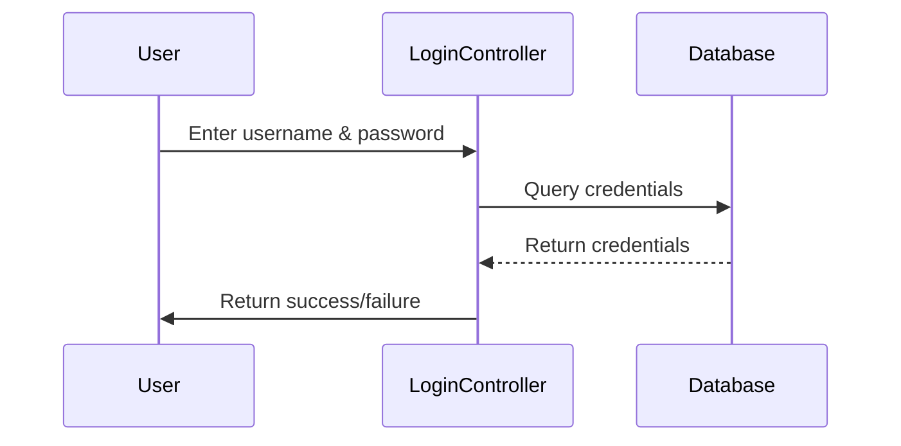

# What is a Sequence Diagram?

A **sequence diagram** is a type of **interaction diagram** used in **UML (Unified Modeling Language)** to model the
flow of messages or events between objects or components over time. It visually represents how processes or objects
interact with each other in a particular sequence to achieve a specific goal or complete a use case. Sequence diagrams
are widely used in software engineering, especially for visualizing and documenting the dynamic behavior of systems.

## Table of Contents

- [Key Elements of a Sequence Diagram](#key-elements-of-a-sequence-diagram)
    - [Objects](#objects)
    - [Lifelines](#lifelines)
    - [Messages](#messages)
    - [Activation Bars](#activation-bars)
    - [Return Messages](#return-messages)
    - [Alt, Opt, and Loop Fragments](#alt-opt-and-loop-fragments)
- [Purpose of a Sequence Diagram](#purpose-of-a-sequence-diagram)
- [Example of a Sequence Diagram](#example-of-a-sequence-diagram)
- [Sample Sequence Diagram with Mermaid Syntax](#sample-sequence-diagram-with-mermaid-syntax)
- [Benefits of Using Sequence Diagrams](#benefits-of-using-sequence-diagrams)
- [Conclusion](#conclusion)

---

## Key Elements of a Sequence Diagram

### **Objects**

Represented by vertical dashed lines, these are the entities involved in the interaction. Typically, these objects are
the system components or classes that communicate with each other.

### **Lifelines**

The dashed vertical lines represent the existence of an object during the sequence. The lifeline indicates that the
object continues to exist during the duration of the interaction.

### **Messages**

Horizontal arrows between lifelines represent communication between objects, such as method calls or messages passed
between them. The direction of the arrow indicates the sender and receiver.

### **Activation Bars**

Thin rectangles on the lifelines that represent the duration an object is active and performing a task. They show when
an object is executing an operation or method.

### **Return Messages**

Dashed arrows indicate the return messages or responses that flow back to the sender after an operation has been
completed.

### **Alt, Opt, and Loop Fragments**

These are special blocks used to represent conditional behaviors (alt for alternative flows), optional parts of a
sequence (opt), or repetitive behavior (loop).

---

## Purpose of a Sequence Diagram:

- **Visualizing Object Interactions**: It helps to visualize how objects or components interact with each other in terms
  of time and sequence.

- **Documenting Use Cases**: Sequence diagrams are often used to model specific use cases, showing how the system
  responds to user inputs.

- **Analyzing System Behavior**: They help analyze how the system behaves over time and can be used to detect issues
  like missing messages or improper communication between objects.

- **Communication and Design**: Sequence diagrams can be used to communicate system design among team members and
  stakeholders. They help to clarify the detailed flow of operations.

---

## Example of a Sequence Diagram:

Let’s consider a sequence diagram for a simple **login process**:

1. **User** enters username and password.
2. The **LoginController** object validates the credentials.
3. The **Database** object is queried to verify the user’s credentials.
4. **LoginController** returns a success or failure message based on the verification.

The sequence diagram would look like this:

- **User** sends a message (input data) to **LoginController**.
- **LoginController** sends a query to **Database**.
- **Database** returns a response (user data or failure).
- **LoginController** sends a result (success or failure) to the **User**.

The flow of messages between the objects would be visually represented by arrows, showing the sequence and timing of
events.

---

## Sample Sequence Diagram with Mermaid Syntax:

Below is a sample sequence diagram using **Mermaid syntax**, which is a simple, text-based way to create diagrams:

### Explanation:

- `User->>LoginController: Enter username & password` indicates that the User sends data to the LoginController.
- `LoginController->>Database: Query credentials` represents the LoginController querying the Database.
- `Database-->>LoginController: Return credentials` shows the Database returning the result.
- `LoginController->>User: Return success/failure` represents the LoginController returning the final result to the
  User.

---

## Benefits of Using Sequence Diagrams:

1. **Clear Representation of Logic**: They provide a clear, step-by-step depiction of how interactions occur over time,
   making it easier to understand the system's logic.

2. **Identifying Performance Bottlenecks**: By showing the sequence of messages, sequence diagrams can help identify
   areas where delays or inefficiencies occur.

3. **Simplifying Complex Interactions**: They are useful for simplifying complex interactions between multiple objects
   by breaking down the entire system behavior into manageable segments.

4. **Enhancing Collaboration**: Sequence diagrams are great for discussing system behavior with other developers,
   designers, or stakeholders, ensuring everyone has a shared understanding.

---

## Conclusion

A sequence diagram is a valuable tool for modeling and visualizing the dynamic interactions between objects or
components in a system. It provides a clear view of the message flow and the sequence of operations, making it essential
in designing and documenting systems. Whether you're building a small application or a large-scale enterprise system,
sequence diagrams can help improve communication, detect errors, and enhance the overall design process. 