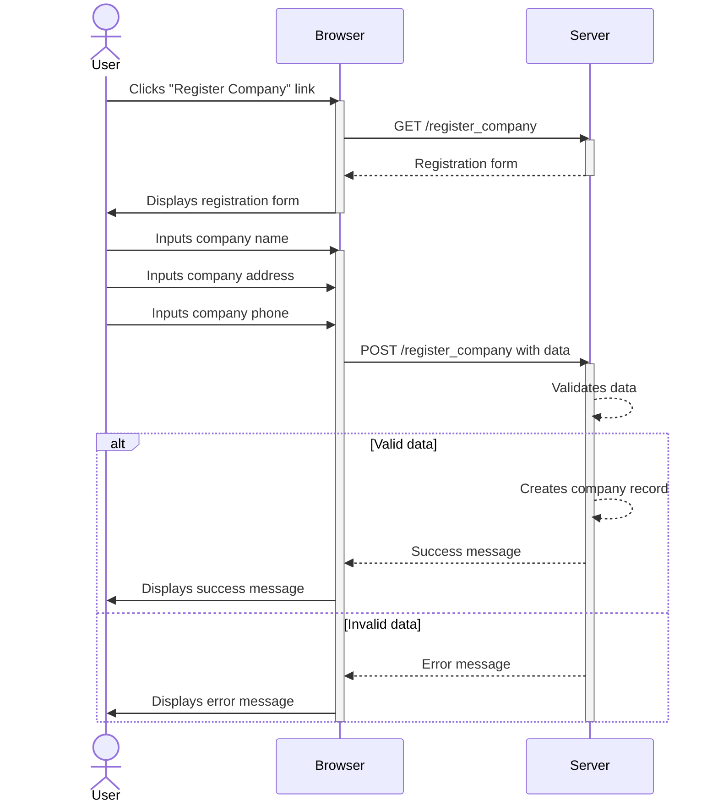

# MVP
Human Resource Information System MVP is a web application designed to support the management of human resources in a company. HRIS MVP will make it easier for companies to manage their employees, including managing employee data, managing attendance, managing salary, and managing employee training.

## Initial Setup

- A new user can register a company

- A new user can create a user admin. 

---

  
  <a href="https://github.com/programinglive/hris">
    Link Repository
  </a>

