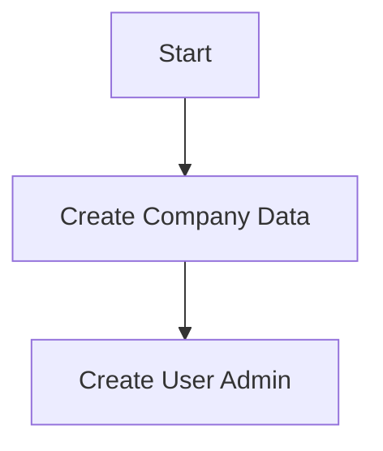
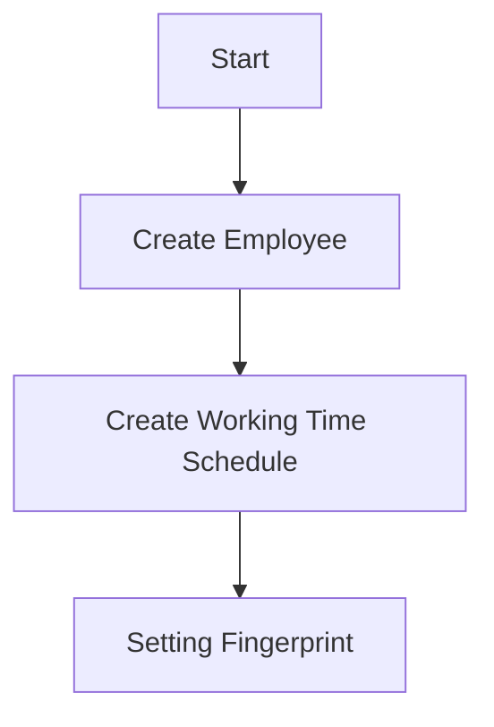

# HRIS
A Human Resource Information System.

Human Resource Information System is a web application designed to support the management of human resources in a company. HRIS will make it easier for companies to manage their employees, including managing employee data, managing attendance, managing salary, and managing employee training.

Repository: [HRIS](https://github.com/programinglive/hris)

## Initial Setup

- go to a register company link
- fill up the form
- create a user admin

## Attendance

- create employee
- create a working time schedule
- setting fingerprint

## Feature
- Employee data
- Attendance

---

  
  <a href="https://github.com/programinglive/hris">
    Link Repository
  </a>

