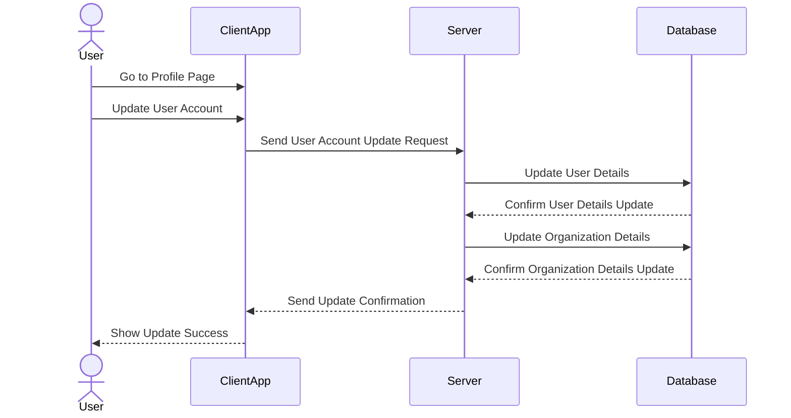

# A new user can edit their account

The ability to edit their account is a critical feature for users in the HRIS system, as it allows them to update their personal information, change their password, and access their account settings. This feature is especially important for users who need to access and update their account information frequently, such as employees who need to update their availability or job seekers who need to update their resume.



## Table of Contents
1. [Overview](#overview)
2. [Features](#features)
3. [API Endpoint Specification](#api-endpoint-specification)
4. [Data Models](#data-models)
5. [Implementation Steps](#implementation-steps)
6. [Example Code](#example-code)
7. [Testing](#testing)
8. [Conclusion](#conclusion)

---

### Overview
The goal of this MVP is to enable users to edit their account details through the `PUT /api/account/edit` endpoint. The focus is on input validation, secure data storage, and appropriate response handling.

### Features
1. **Account Editing**: Allows users to update their account details.
2. **Input Validation**: Ensures data integrity by validating user input.
3. **Database Update**: Saves updated user data securely in the database.
4. **Response Handling**: Returns success or error messages based on the update result.
5. **Security Measures**: Only authenticated users can edit their accounts.

---

### API Endpoint Specification

- **Endpoint**: `PUT /api/account/edit`
- **Description**: Allows authenticated users to update their account information.

#### Request Headers
- `Content-Type: application/json`
- `Authorization: Bearer <token>`

#### Request Body

| Field    | Type   | Required | Description                        |
|----------|--------|----------|------------------------------------|
| email    | String | No       | New email address of the user.     |
| username | String | No       | New username of the user.          |
| phone    | String | No       | New phone number of the user.      |
| password | String | No       | New password (if changing).        |

#### Example Request Body
```json
{
  "email": "newemail@example.com",
  "username": "newusername",
  "phone": "+123456789",
  "password": "newSecurePassword123"
}
```

#### Response
- **Success (200 OK)**
  ```json
  {
    "message": "Account updated successfully.",
    "data": {
      "email": "newemail@example.com",
      "username": "newusername",
      "phone": "+123456789",
      "updatedAt": "2024-04-27T12:34:56Z"
    }
  }
  ```
- **Error (400 Bad Request)**
  ```json
  {
    "message": "Account update failed.",
    "errors": {
      "email": "Invalid email format.",
      "username": "Username is required."
    }
  }
  ```
- **Error (401 Unauthorized)**
  ```json
  {
    "message": "Unauthorized access. Please provide valid credentials."
  }
  ```

---

### Data Models

#### User Model (updated)

| Field       | Type     | Description                            |
|-------------|----------|----------------------------------------|
| id          | Integer  | Unique identifier for the user.        |
| email       | String   | User's email address.                  |
| username    | String   | Unique username of the user.           |
| phone       | String   | User's phone number.                   |
| password    | String   | Hashed password for secure storage.    |
| created_at  | DateTime | Timestamp when the user account was created. |
| updated_at  | DateTime | Timestamp when the account was last updated. |

---

### Implementation Steps

1. **Set Up the Project**
    - Initialize a Laravel project with `laravel new project-name`.
    - Configure authentication using Laravel Sanctum or Passport for token-based auth.

2. **Define Route in `api.php`**
    - Define the endpoint for updating account details in `routes/api.php`:
      ```php
      Route::middleware('auth:sanctum')->put('/account/edit', [UserController::class, 'updateAccount']);
      ```

3. **Create `UserController` and `updateAccount` Method**
    - Use `php artisan make:controller UserController` to create the controller.

4. **Implement Validation Rules**
    - Inside `UserController`, validate email format, unique username, and password security.
    - Example validation:
      ```php
      $validatedData = $request->validate([
          'email' => 'nullable|email|unique:users,email,' . $request->user()->id,
          'username' => 'nullable|string|unique:users,username,' . $request->user()->id,
          'phone' => 'nullable|string',
          'password' => 'nullable|min:8',
      ]);
      ```

5. **Update Account Logic**
    - Update user details only if the fields are provided.
    - Hash the password if it’s being updated:
      ```php
      if ($request->filled('password')) {
          $validatedData['password'] = bcrypt($request->password);
      }
      $request->user()->update($validatedData);
      ```

6. **Response Handling**
    - Return a JSON response indicating success or failure with status codes.

---

### Example Code (UserController)

#### UserController
```php
namespace App\Http\Controllers;

use Illuminate\Http\Request;
use Illuminate\Support\Facades\Hash;
use Illuminate\Validation\ValidationException;

class UserController extends Controller
{
    public function updateAccount(Request $request)
    {
        $validatedData = $request->validate([
            'email' => 'nullable|email|unique:users,email,' . $request->user()->id,
            'username' => 'nullable|string|unique:users,username,' . $request->user()->id,
            'phone' => 'nullable|string',
            'password' => 'nullable|min:8',
        ]);

        // Update password if provided
        if ($request->filled('password')) {
            $validatedData['password'] = Hash::make($request->password);
        }

        // Update user data
        $request->user()->update($validatedData);

        return response()->json([
            'message' => 'Account updated successfully.',
            'data' => [
                'email' => $request->user()->email,
                'username' => $request->user()->username,
                'phone' => $request->user()->phone,
                'updatedAt' => $request->user()->updated_at,
            ]
        ], 200);
    }
}
```

---

### Testing

1. **Successful Update**
    - Use valid data for each field and verify a `200 OK` response.

2. **Invalid Data**
    - Test with an invalid email or duplicate username. Expect a `400 Bad Request` response with error messages.

3. **Unauthorized Access**
    - Attempt to access the endpoint without a valid token. Expect a `401 Unauthorized` response.

4. **Database Constraints**
    - Ensure the database returns errors for missing required fields in case of failure.

---

### Conclusion
This MVP enables users to securely edit their account information through Laravel. The implementation prioritizes essential features—validation, authentication, and clear response handling—while ensuring the integrity of user data. Future improvements can include more detailed logging, account security features, and additional validation constraints.